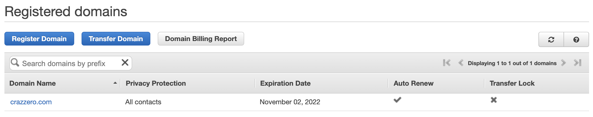
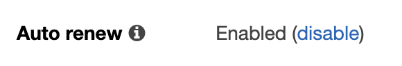

# AWS domain

AWS 에서 도메인 구매하는 방법

1. [AWS](https://aws.amazon.com/free/) 에 접속한다.

2. 콘솔에 로그인한다. (루트 계정으로 로그인 해야한다)

3. route53 검색후 서비스에 접속한다.

4. Registrer domain 박스에 만들고 싶은 도메인을 구입한다.

5. 구매하고 싶은 domain 선택 후 continue 버튼을 눌러서 구매를 진행한다.

AWS 에서 도메인을 구매하면 매년 자동결재된다.  
지금은 12달러인데, 가격변동이 있으면 메일링 해준다고 한다.  

만약, 자동갱신되는게 싫다면 Registered domains 탭에 들어가 Auto renew 설정을 disable 로 변경해주면 된다.

