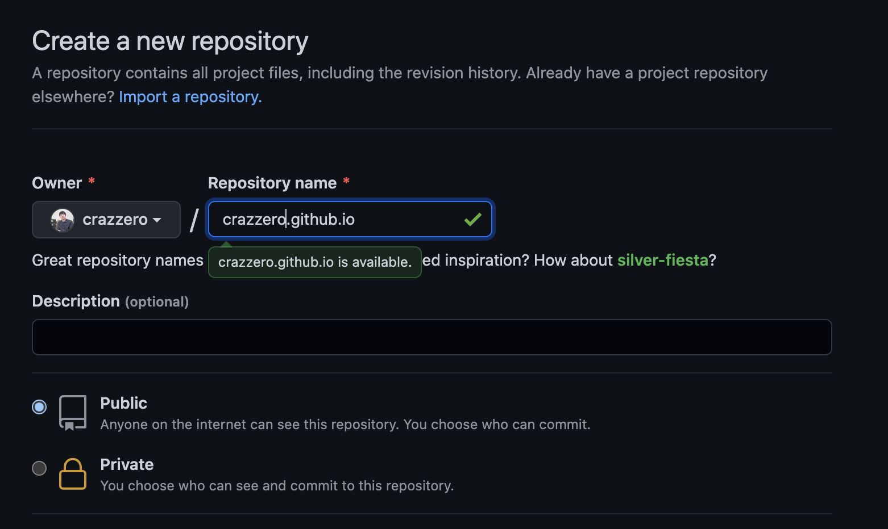
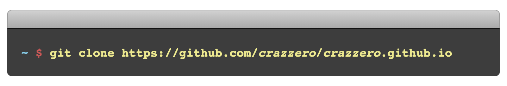
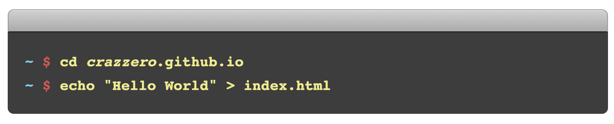
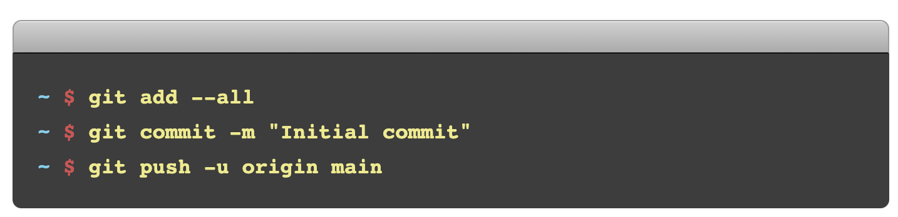

# [📝 Pages](https://pages.github.com/)

> Websites for you and your projects.
> Hosted directly from your GitHub repository. Just edit, push, and your changes are live.

github 에서는 pages 를 통해 github repository 를 실시간으로 호스팅 하는 기능을 제공한다.  

## 예시

pages: [crazzero pages](https://crazzero.github.io)  
project : [crazzero pages project](https://github.com/crazzero/crazzero.github.io)

## What is GitHub Pages?

## Limitation

pages 는 account, organization 별로 한 개씩, 그리고 project 에서는 제한없이 만들 수 있다.

## 순서

1. Github 에서 {username}.github.io 으로 repository 를 만든다.  

2. terminal 에서 생성한 repository 를 clone 한다.  

3. clone 한 프로젝트로 이동해서, index.html 에 "Hello World" 를 넣어준다.  

4. 변경된 부분을 commit 하고 Github repository 에 push 한다.  

