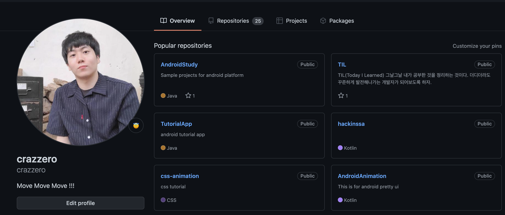
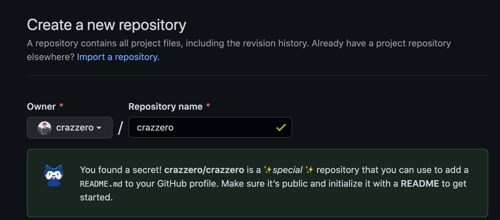
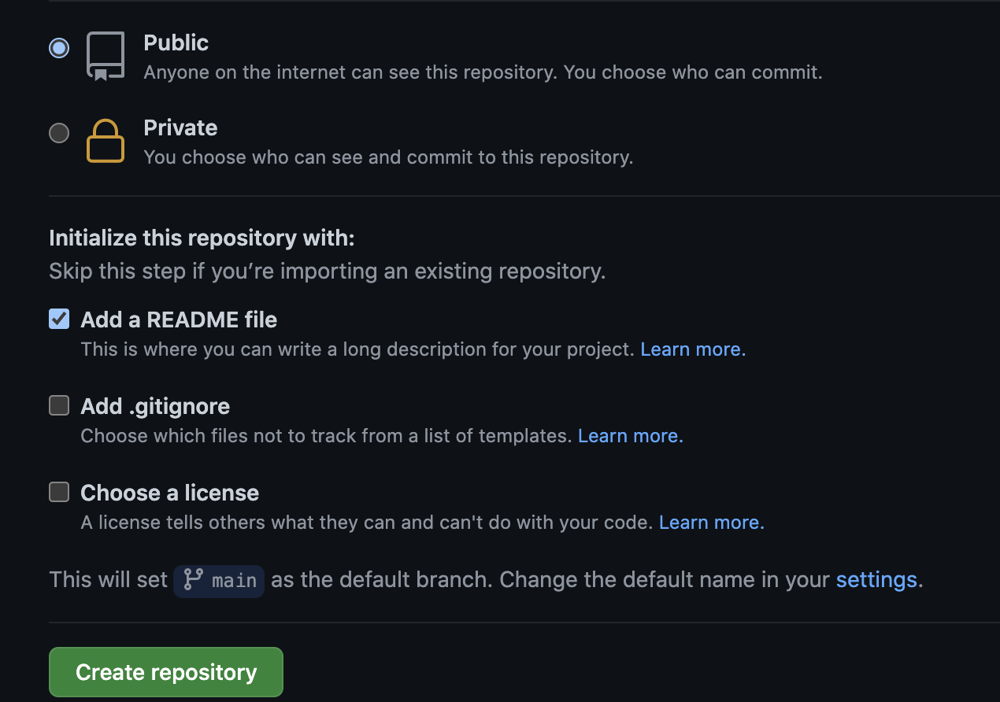

# Profile

github 에서는 github id 로 project 를 만들고, 해당 project 에 README.md 를 추가하여 간단하게 Profile 을 자신만의 만들 수 있다

## 순서

1. 본인의 [github account](https://github.com/crazzero) 페이지로 이동한다

2. Repositories 탭으로 이동한 후 New 버튼을 눌러서 Create a new repository 페이지로 이동한다
3. 본인 github id 로 repository 이름을 설정하면 다음과 같이 `You found a secret!` 라고 하면서 뭔가 특별한 배너가 생성되는 것을 확인할 수 있다

4. 해당 repository 를 반드시 public 그리고 Add a README file 을 체크 해주고 만들어준다

5. repository 가 생성되고 다른 repository 와는 다르게 오른쪽에 crazzero/crazzero 는 특별한 repository 라고 알려주는 탭이 있다 

6. profile 을 확인하면 해당 README.md  내용이 profile 에 적용되어 있는 것을 확인할 수 있다

